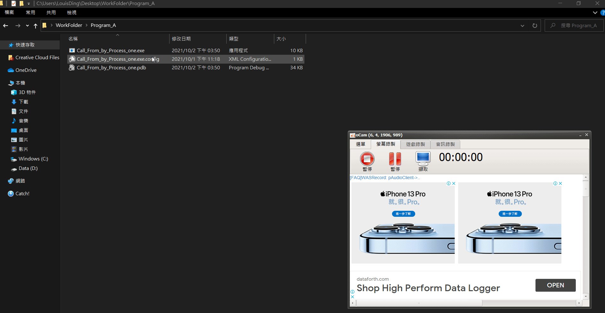

## 1. 前言
 由於專案上的需求，因此思考如何透過程式去啟動程式，大致上有Process與Application這兩個類別的方法可以使用，目前先以Process編寫，效果還不錯，之後再用Application去嘗試看看，先看以下Process方式的寫法吧。


## 2. 作法

### Step 1. 新增專案，並建立類似以下介面


### Step 2. 編寫開啟程式的語法

先建立Process物件，然後建立觸發事件來呼叫要啟動的程式，範例如下:

建立物件:
```cs
private Process process= new Process();
```

建立觸發事件:
```cs
private void btn_RunProgram_Click(object sender, EventArgs e)
{
    //設定是否用是否要使用作業系統 Shell 來啟動處理序
    process_A.StartInfo.UseShellExecute = false;
    //設定開啟檔案了路徑
    process_A.StartInfo.FileName = 啟動程式的路徑;
    //設定是否開啟新視窗
    process_A.StartInfo.CreateNoWindow = true;
    //開始執行
    process_A.Start();
}
```

### Step 3. 編寫開啟程式的語法

先建立Process物件的Array，來蒐集需要操作的程式，範例如下:

建立Process物件的Array
```cs
private Process[] processes_A;
```

建立觸發事件:
```cs
 private void btn_CloseProgram_Click(object sender, EventArgs e)
 {
     //取的"程式"的執行序
     processes_A = Process.GetProcessesByName("要關閉的程式名稱");
     if (processes_A.Length > 0)
     {
         //依序關閉"程式"
         for (int i = 0; i < processes_A.Length; i++)
         {
             processes_A[i].CloseMainWindow();
             Thread.Sleep(1000);
         }
     }
}
```

說明:
利用Array去蒐集，主要是考量到這個範例，程式可以重複被開啟與執行

## 3. 完整程式碼
### Porgram A
Code:
```cs
using System;
using System.Diagnostics;
using System.IO;
using System.Threading;
using System.Windows.Forms;

namespace Call_From_by_Process_one
{
    public partial class Program_A : Form
    {
        //建立Process_A的物件
        private Process process_A = new Process();

        //建立Processes_A的Array，蒐集目前"程式B"的執行序
        private Process[] processes_A;

        public Program_A()
        {
            InitializeComponent();
        }

        /// <summary>
        /// 關閉"程式B"的觸發事件
        /// </summary>
        /// <param name="sender"></param>
        /// <param name="e"></param>
        private void btn_CloseProgram_B_Click(object sender, EventArgs e)
        {
            //取的"程式B"的執行序
            processes_A = Process.GetProcessesByName("Call_From_by_Process_two");
            if (processes_A.Length > 0)
            {
                //依序關閉"程式B"
                for (int i = 0; i < processes_A.Length; i++)
                {
                    processes_A[i].CloseMainWindow();
                    Thread.Sleep(1000);
                }
            }
        }

        /// <summary>
        /// 啟動"程式B"的觸發事件
        /// </summary>
        /// <param name="sender"></param>
        /// <param name="e"></param>
        private void btn_RunProgram_B_Click(object sender, EventArgs e)
        {
            //設定是否用是否要使用作業系統 Shell 來啟動處理序
            process_A.StartInfo.UseShellExecute = false;
            //設定開啟檔案了路徑
            process_A.StartInfo.FileName = Path.Combine(Application.StartupPath, @"../Program_B/Call_From_by_Process_two.exe");
            //設定是否開啟新視窗
            process_A.StartInfo.CreateNoWindow = true;
            //開始執行
            process_A.Start();
        }
    }
}
```

### Program B
```cs
using System;
using System.Collections.Generic;
using System.ComponentModel;
using System.Data;
using System.Diagnostics;
using System.Drawing;
using System.IO;
using System.Linq;
using System.Text;
using System.Threading;
using System.Threading.Tasks;
using System.Windows.Forms;

namespace Call_From_by_Process_two
{
    public partial class Program_B : Form
    {
        private Process process_B = new Process();
        private Process[] process_detect;

        public Program_B()
        {
            InitializeComponent();
        }

        private void btn_CloseProgram_A_Click(object sender, EventArgs e)
        {
            process_detect = Process.GetProcessesByName("Call_From_by_Process_one");
            if (process_detect.Length > 0)
            {
                for (int i = 0; i < process_detect.Length; i++)
                {
                    process_detect[i].CloseMainWindow();
                    Thread.Sleep(1000);
                }
            }
        }

        private void btn_RunProgram_A_Click(object sender, EventArgs e)
        {
            process_B.StartInfo.UseShellExecute = false;
            process_B.StartInfo.FileName = Path.Combine(Application.StartupPath, @"../Program_A/Call_From_by_Process_one.exe");
            process_B.StartInfo.CreateNoWindow = true;
            process_B.Start();
        }
    }
}
```

執行結果:


附上Source Code: [active_program_by_program](https://github.com/JJDing-Louis/active_program_by_program)

完整程式: [WorkFolder.zip](https://github.com/JJDing-Louis/active_program_by_program/raw/main/WorkFolder.zip)

## 4. 常見問題
1. 什麼是**Application.StartupPath**?
**Application.StartupPath** => 這個含是可以用來取得當下執行檔的路徑，而**Path.Combine()** 是用來合併兩個路徑。
2. 為什麼不用**GetProcessById()**?
 當每次執行Procress時，電腦分配的ProcressID都不一樣，但是Name會相同，雇用Name取得執行序比較合適。

## 5. 參考資料
### 開啟程式:
1. [Process 類別(MSDN)](https://docs.microsoft.com/zh-tw/dotnet/api/system.diagnostics.process?redirectedfrom=MSDN&view=net-5.0#examples)
2. [Process.Start 方法(MSDN)](https://docs.microsoft.com/zh-tw/dotnet/api/system.diagnostics.process.start?view=net-5.0#System_Diagnostics_Process_Start_System_String_System_String_)
3. [ProcessStartInfo 類別](https://docs.microsoft.com/zh-tw/dotnet/api/system.diagnostics.processstartinfo?view=net-5.0#properties)

### 關閉程式:
1. [【C#】如何從C#關閉另一個程序](https://www.796t.com/post/NW80Znc=.html)
2. [【C#】當應用程式關閉時，關閉另一個程序](https://www.796t.com/post/OXN1bnU=.html)
3. [C#實現關閉其他程式視窗或程式程式碼分享](https://www.itread01.com/article/1433408951.html)

### Application的用法
1. [Application 類別(MSDN)](https://docs.microsoft.com/zh-tw/dotnet/api/system.windows.application?view=net-5.0#methods)
2. [Control another application using C#](https://stackoverflow.com/questions/1134993/control-another-application-using-c-sharp) 
3. [C# Application.Start方法代碼示例](https://vimsky.com/zh-tw/examples/detail/csharp-ex---Application-Start-method.html) 
4. [Application.Startup 事件(MSDN)](https://docs.microsoft.com/zh-tw/dotnet/api/system.windows.application.startup?view=net-5.0)

### 路徑表示的寫法
1. [C#檔案路徑的寫法](https://www.itread01.com/content/1546176603.html)
2. [路徑表示法...](http://web12.ravs.ntct.edu.tw/know/show.asp?QUESTIONID=29)
3. [何謂絕對路徑與相對路徑](https://mitblog.pixnet.net/blog/post/24971111)
